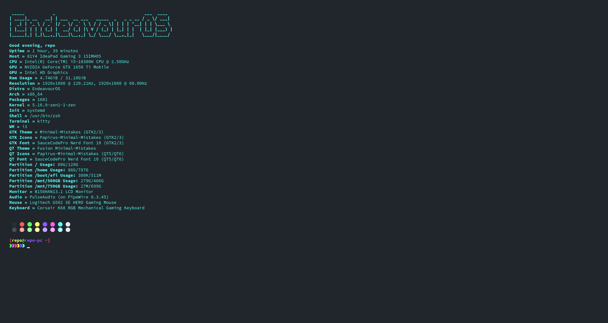

```
	 ____  _   _ _____ _	 _	   _____ _____ _____ ____ _   _
	/ ___|| | | | ____| |	| |   |  ___| ____|_   _/ ___| | | |
	\___ \| |_| |  _| | |	| |   | |_	|  _|	| || |	 | |_| |
	 ___) |  _	| |___| |___| |___|  _| | |___	| || |___|	_  |
	|____/|_| |_|_____|_____|_____|_|	|_____| |_| \____|_| |_|

		Shell System Information Fetcher - v2022.02.16
		A modular, hackable, fetch script written in Bash

		This program may be freely redistributed
		under the terms of The GPL-TRC License.

		The-Repo-Club <wayne6324@gmail.com>
```

<p align='center'>
	
	
	
	
	
	
	
</p>

# How do I install shellfetch?

[](https://github.com/basherpm/basher)

### on Arch BTW?

Follow one of the 3 simple ways to install below.

Download: [PKGBUILD](https://github.com/The-Repo-Club/ArchAUR/raw/main/shellfetch/PKGBUILD) and make with `makepkg -sfi`

Install: [Custom Repo](https://arch.therepo.club/) then just use `pacman -S shellfetch`

AUR: [YAY](https://aur.archlinux.org/packages/shellfetch) just use `yay -S shellfetch`

### Anything other then Arch base.

First, install the dependencies: xrandr, figlet and bash.
Then run the following commands

```
git clone https://github.com/The-Repo-Club/shellfetch ~/.shellfetch
cd ~/.shellfetch
sudo make install
```

# Usage

Flags:

```
-s	|	--source	)	specify config file path
-f	|	--file		)	specify ascii art
-c	|	--center	)	print on center
-v	|	--version	)	get version info
-sc	|	--setcolors	)	change the colors of the output
-h	|	--help		)	get help
```

# Configuration

You can edit the ~/.config/shellfetch/config.conf file to reorder segments, add your own functions, or remove some.
You can also set ascii art, color and to be centered or not.

## Add a new function

1. Create a function at the top of the config like below.

```
get_test() {
	PrintLine "$Alignment" "${boldText}${headPageColor}%b${resetColor}${sysPageColor}%b${resetColor}" "Header $sep " "Body of the text to display can also include ${var}'s"
}
```

2. Call the function within the segments section of the config.

# Man Screenshots

<details>
	<summary>Click to view!</summary>


</details>

# Screenshots

<details>
	<summary>Click to view!</summary>





</details>
